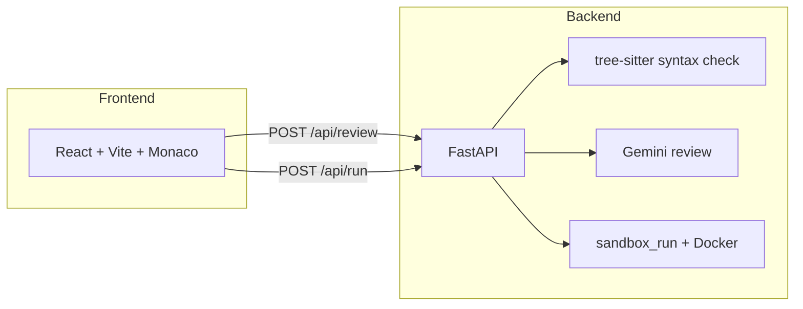

# GenAI Code Review & Sandbox Runner

Full-stack app for **AI-assisted code review** (Google Gemini) and **sandboxed execution** of Python, TypeScript, and Java. The UI is a React + Monaco editor; the API is FastAPI with optional Docker-based isolation for runs.

## Architecture



| Layer | Stack |
|--------|--------|
| Frontend | React 19, TypeScript, Vite 8, Monaco Editor |
| Backend | FastAPI, Pydantic Settings, `google-genai`, tree-sitter |
| Execution | Host or Docker image `cellebrite-code-sandbox:local` (see `sandbox/Dockerfile`) |

Environment variables are loaded from `backend/.env` or a `.env` at the repository root (see [Configuration](#configuration)).

## Screenshot

<p align="center">
  
</p>

## Demo video

The walkthrough was recorded on macOS, then **compressed and sped up to 4×** for submission. File in the repo: **[`docs/demo-4x.mp4`](docs/demo-4x.mp4)** (H.264, ~54s wall time, no audio, under GitHub’s ~10 MB upload limit).

<p align="center">
  <video controls width="920" src="docs/demo-4x.mp4">
    <a href="docs/demo-4x.mp4">Open demo video (MP4)</a>
  </video>
</p>

If no player appears on **github.com** (relative `<video>` is often stripped there), use **[▶ Play demo video](docs/demo-4x.mp4)** or the upload steps below.

### Watch on GitHub (no extra setup)

On **github.com**, a normal Markdown link to the committed file opens the **file view**, which includes GitHub’s own video player:

**[▶ Play demo video](docs/demo-4x.mp4)**

(After you push, that resolves to `…/blob/…/docs/demo-4x.mp4` — use the **Play** control on that page.)

### Inline player *inside* the README (optional)

GitHub **does not** inline-play videos that live only inside the repo (relative paths or `raw.githubusercontent.com` in a `<video>` tag are ignored or stripped). It **does** show a native player when the README contains a URL to a file GitHub stored from the **web editor upload** — the link looks like `https://user-images.githubusercontent.com/…/….mp4` (same mechanism as issues/PRs). See the working bare-URL style in [huntharo/video-test](https://github.com/huntharo/video-test/blob/main/README.md).

**One-time steps** so the demo plays directly on the repo home page:

1. Push this repository to GitHub.
2. Open **`README.md`** on GitHub → click **Edit** (pencil).
3. Put the cursor **on its own line** where you want the inline video (e.g. under this list).
4. Drag **`docs/demo-4x.mp4`** from your machine into the editor (or use **Attach files**). Wait for the upload to finish.
5. GitHub will insert a long `https://user-images.githubusercontent.com/…mp4` URL. **Leave that URL alone on its own line** (or wrap it in `<video controls src="…" width="100%"></video>` — both work on github.com).
6. **Commit** the change to your default branch.

The file stays in **`docs/demo-4x.mp4`** for clones and assignments; the extra line is only a hosted copy for README rendering.

## Setup and installation

### Prerequisites

- **Python** 3.11+ (3.13 used in development)
- **Node.js** 20+ (for the frontend and TS sandbox tooling inside the Docker image)
- **Docker** (optional but recommended for `/api/run` when `SANDBOX_ENABLED=true`)
- **JDK 17** on the host if you run Java without Docker / for fallback paths (`JAVA_HOME`)

### Backend

```bash
cd backend
python -m venv .venv
source .venv/bin/activate   # Windows: .venv\Scripts\activate
pip install -r requirements.txt
```

Create `backend/.env` (or `.env` at repo root) with at least:

```env
GEMINI_API_KEY=your_key_here
```

Optional variables are documented in [Configuration](#configuration).

Run the API:

```bash
uvicorn app.main:app --reload --host 0.0.0.0 --port 8000
```

### Sandbox image (for code execution)

From the repository root:

```bash
docker build -t cellebrite-code-sandbox:local -f sandbox/Dockerfile sandbox
```

### Frontend

```bash
cd frontend
npm install
npm run dev
```

By default Vite serves on `http://localhost:5173`. Point the UI at the API with a **vite proxy** or `VITE_API_BASE`:

```bash
# Example: API on port 8000, no proxy — set base URL at build/dev time
VITE_API_BASE=http://127.0.0.1:8000 npm run dev
```

The backend allows CORS for `http://localhost:5173` and `http://127.0.0.1:5173` by default (`CORS_ORIGINS`).

### Health check

```bash
curl -s http://127.0.0.1:8000/health
# {"status":"ok"}
```

## API documentation

Interactive OpenAPI docs are served by FastAPI:

- **Swagger UI:** `http://127.0.0.1:8000/docs`
- **ReDoc:** `http://127.0.0.1:8000/redoc`

### `GET /health`

Liveness probe. **Response:** `{ "status": "ok" }`.

### `POST /api/review`

Runs static syntax validation (tree-sitter) and an asynchronous **Gemini** review.

**Request body (JSON):**

| Field | Type | Description |
|-------|------|-------------|
| `language` | `"python"` \| `"typescript"` \| `"java"` | Source language |
| `code` | string | Source code (size limits apply; see config) |

**Success (200):** `ReviewResponse`

| Field | Type | Description |
|-------|------|-------------|
| `syntax` | object | `{ "valid": bool, "errors": [...] }` |
| `findings` | array | Structured issues: category, title, detail, suggestion, optional severity/lines |
| `summary` | string | Short overview |
| `better_implementation_code` | string | Suggested improved code (may be empty) |
| `better_implementation_explanation` | string | Explanation for the suggestion |

**Errors:** `400` invalid input, `503` review unavailable (e.g. API/key/model issues).

### `POST /api/run`

Executes code in the configured sandbox (Docker by default).

**Request body (JSON):**

| Field | Type | Description |
|-------|------|-------------|
| `language` | `"python"` \| `"typescript"` \| `"java"` | Runtime |
| `code` | string | Program source |
| `stdin` | string | Standard input (optional, length capped) |

**Success (200):** `RunResponse` — `exit_code`, `stdout`, `stderr`, `timed_out`, `duration_ms`, optional `error`.

**Errors:** `400` invalid input; sandbox failures surface in response fields or HTTP errors as implemented.

## Configuration

Defined in `backend/app/config.py` (env vars):

| Variable | Purpose |
|----------|---------|
| `GEMINI_API_KEY` | Google AI API key for reviews |
| `GEMINI_MODEL` | Model id (default `gemini-2.5-flash`) |
| `REVIEW_TIMEOUT_SEC` | LLM timeout |
| `CORS_ORIGINS` | Comma-separated allowed origins |
| `JAVA_HOME` | Host JDK for Java-related paths when applicable |
| `MAX_CODE_BYTES`, `MAX_STDIN_BYTES`, `MAX_OUTPUT_BYTES` | Input/output limits |
| `SANDBOX_ENABLED` | Enable containerized runs |
| `SANDBOX_IMAGE` | Docker image name (default `cellebrite-code-sandbox:local`) |
| `SANDBOX_TIMEOUT_SEC`, `SANDBOX_MEMORY_MB`, `SANDBOX_CPUS` | Sandbox resource limits |

## Sample test cases (input snippets and expected behavior)

LLM **wording** of titles and summaries varies between calls; treat the following as **structural** expectations: valid syntax flag, finding categories, and that security/logic issues are surfaced. Example shapes were captured under `eval/runs/20260408T125101Z/`.

### 1. Python — logic bug and division by zero

**Input code:**

```python
def avg(a, b):
    return (a + b) / (a - b)
```

**Expected (representative):**

- `syntax.valid` → `true`
- Findings include **logic** items such as: wrong formula for an “average”, **`ZeroDivisionError`** when `a == b`, and possibly **style** (misleading name `avg`).
- `better_implementation_code` often suggests `(a + b) / 2`.

### 2. Java — SQL injection pattern

**Input code (illustrative fragment):**

```java
public ResultSet userById(Statement st, String id) throws SQLException {
  String sql = "SELECT * FROM users WHERE id = " + id;
  return st.executeQuery(sql);
}
```

**Expected (representative):**

- `syntax.valid` → `true` (if the full snippet compiles in context)
- At least one **security** finding: SQL injection via string concatenation; suggestion to use **`PreparedStatement`** and `?` placeholders.
- Possible **logic** findings: resource handling / returning raw `ResultSet`.

### 3. Python — command injection via `shell=True`

**Input code:**

```python
import subprocess

def run_tool(user_arg: str) -> str:
    return subprocess.check_output(
        f"grep {user_arg} /tmp/data.txt", shell=True, text=True
    )
```

**Expected (representative):**

- `syntax.valid` → `true`
- **Security** finding: shell injection; suggestion to use argument list form without `shell=True`.
- Possible **performance** (unnecessary shell) and **logic** (error handling) findings.

### Automated tests in the repo

Backend unit/API tests live under `backend/tests/` (pytest). Run:

```bash
cd backend && source .venv/bin/activate && pytest -q
```

## Key design decisions and trade-offs

1. **Syntax before LLM** — tree-sitter gives deterministic parse errors; the model focuses on semantics, security, and style.
2. **Sandboxed execution** — untrusted code runs in a constrained Docker environment with timeouts and output caps; trade-off: Docker build/host setup vs. safety.
3. **Gemini for review** — strong generalization across languages; trade-off: network dependency, cost, and non-deterministic phrasing (mitigated by structured JSON-style fields in code).
4. **Monorepo layout** — `frontend/` and `backend/` keep dependencies separate (`package.json` vs `requirements.txt`).

## Known limitations and future improvements

- Review text and finding counts **vary** by model and temperature; evaluation should check structure and presence of issue types, not exact strings.
- Very large files are rejected by byte limits; streaming or chunked review could be added later.
- **GitHub README** may not play inline video; keep **`docs/demo-4x.mp4`** as the portable artifact.
- Optional: root-level `package.json` workspace file if your grader expects a single manifest at repo root (currently **`frontend/package.json`** is authoritative for Node).

## Dependencies

- **Python:** [`backend/requirements.txt`](backend/requirements.txt)
- **Node:** [`frontend/package.json`](frontend/package.json)

---

**Assignment checklist mapping**

| Requirement | Location |
|-------------|----------|
| Source (frontend + backend) | `frontend/`, `backend/`, `sandbox/` |
| README (setup, API, design, limits) | This file |
| Dependencies listed | `backend/requirements.txt`, `frontend/package.json` |
| Demo | [`docs/demo-4x.mp4`](docs/demo-4x.mp4) + [Setup and installation](#setup-and-installation) |
| Sample test cases | [Sample test cases](#sample-test-cases-input-snippets-and-expected-behavior) section |
