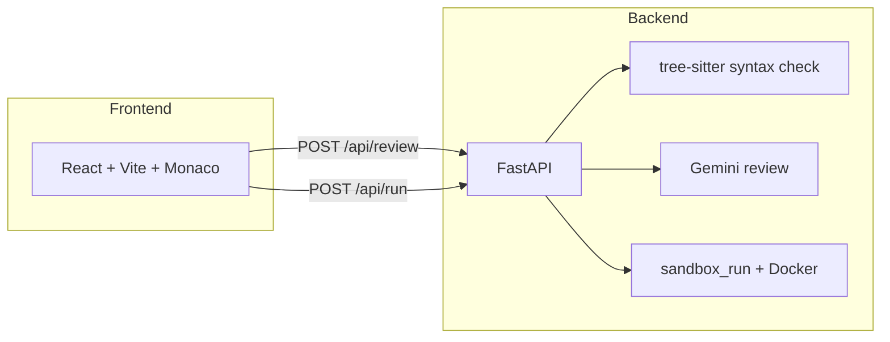
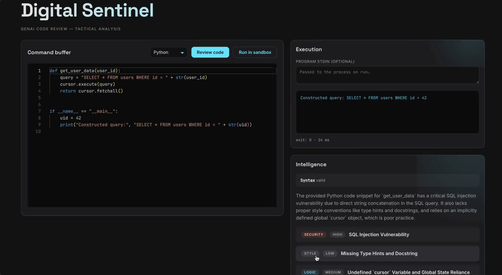

# GenAI Code Review & Sandbox Runner

Full-stack app for **AI-assisted code review** (Google Gemini) and **sandboxed execution** of Python, TypeScript, and Java. The UI is a React + Monaco editor; the API is FastAPI with optional Docker-based isolation for runs.

## Architecture



| Layer     | Stack                                                                           |
| --------- | ------------------------------------------------------------------------------- |
| Frontend  | React 19, TypeScript, Vite 8, Monaco Editor                                     |
| Backend   | FastAPI, Pydantic Settings, `google-genai`, tree-sitter                         |
| Execution | Host or Docker image `cellebrite-code-sandbox:local` (see `sandbox/Dockerfile`) |


Environment variables are loaded from `backend/.env` or a `.env` at the repository root (see [Configuration](#configuration)).

## Screenshot

<p align="center">
  
</p>

## Demo video

Open the file here:

**[▶ Watch demo video — `docs/demo-4x.mp4`](docs/demo-4x.mp4)**

## Setup and installation

### Prerequisites

- **Python** 3.11+ (3.13 used in development)
- **Node.js** 20+ (for the frontend and TS sandbox tooling inside the Docker image)
- **Docker** (optional but recommended for `/api/run` when `SANDBOX_ENABLED=true`)
- **JDK 17** on the host if you run Java without Docker / for fallback paths (`JAVA_HOME`)

### Backend

```bash
cd backend
python -m venv .venv
source .venv/bin/activate   # Windows: .venv\Scripts\activate
pip install -r requirements.txt
```

Create `backend/.env` (or `.env` at repo root) with at least:

```env
GEMINI_API_KEY=your_key_here
```

Optional variables are documented in [Configuration](#configuration).

Run the API:

```bash
uvicorn app.main:app --reload --host 0.0.0.0 --port 8000
```

### Sandbox image (for code execution)

From the repository root:

```bash
docker build -t cellebrite-code-sandbox:local -f sandbox/Dockerfile sandbox
```

### Frontend

```bash
cd frontend
npm install
npm run dev
```

By default Vite serves on `http://localhost:5173`. Point the UI at the API with a **vite proxy** or `VITE_API_BASE`:

```bash
# Example: API on port 8000, no proxy — set base URL at build/dev time
VITE_API_BASE=http://127.0.0.1:8000 npm run dev
```

The backend allows CORS for `http://localhost:5173` and `http://127.0.0.1:5173` by default (`CORS_ORIGINS`).

### Health check

```bash
curl -s http://127.0.0.1:8000/health
# {"status":"ok"}
```

## API documentation

Interactive OpenAPI docs are served by FastAPI:

- **Swagger UI:** `http://127.0.0.1:8000/docs`
- **ReDoc:** `http://127.0.0.1:8000/redoc`

### `GET /health`

Liveness probe. **Response:** `{ "status": "ok" }`.

### `POST /api/review`

Runs static syntax validation (tree-sitter) and an asynchronous **Gemini** review.

**Request body (JSON):**


| Field      | Type                                   | Description                                 |
| ---------- | -------------------------------------- | ------------------------------------------- |
| `language` | `"python"` | `"typescript"` | `"java"` | Source language                             |
| `code`     | string                                 | Source code (size limits apply; see config) |


**Success (200):** `ReviewResponse`


| Field                               | Type   | Description                                                                     |
| ----------------------------------- | ------ | ------------------------------------------------------------------------------- |
| `syntax`                            | object | `{ "valid": bool, "errors": [...] }`                                            |
| `findings`                          | array  | Structured issues: category, title, detail, suggestion, optional severity/lines |
| `summary`                           | string | Short overview                                                                  |
| `better_implementation_code`        | string | Suggested improved code (may be empty)                                          |
| `better_implementation_explanation` | string | Explanation for the suggestion                                                  |


**Errors:** `400` invalid input, `503` review unavailable (e.g. API/key/model issues).

### `POST /api/run`

Executes code in the configured sandbox (Docker by default).

**Request body (JSON):**


| Field      | Type                                   | Description                              |
| ---------- | -------------------------------------- | ---------------------------------------- |
| `language` | `"python"` | `"typescript"` | `"java"` | Runtime                                  |
| `code`     | string                                 | Program source                           |
| `stdin`    | string                                 | Standard input (optional, length capped) |


**Success (200):** `RunResponse` — `exit_code`, `stdout`, `stderr`, `timed_out`, `duration_ms`, optional `error`.

**Errors:** `400` invalid input; sandbox failures surface in response fields or HTTP errors as implemented.

## Configuration

Defined in `backend/app/config.py` (env vars):


| Variable                                                   | Purpose                                                     |
| ---------------------------------------------------------- | ----------------------------------------------------------- |
| `GEMINI_API_KEY`                                           | Google AI API key for reviews                               |
| `GEMINI_MODEL`                                             | Model id (default `gemini-2.5-flash`)                       |
| `REVIEW_TIMEOUT_SEC`                                       | LLM timeout                                                 |
| `CORS_ORIGINS`                                             | Comma-separated allowed origins                             |
| `JAVA_HOME`                                                | Host JDK for Java-related paths when applicable             |
| `MAX_CODE_BYTES`, `MAX_STDIN_BYTES`, `MAX_OUTPUT_BYTES`    | Input/output limits                                         |
| `SANDBOX_ENABLED`                                          | Enable containerized runs                                   |
| `SANDBOX_IMAGE`                                            | Docker image name (default `cellebrite-code-sandbox:local`) |
| `SANDBOX_TIMEOUT_SEC`, `SANDBOX_MEMORY_MB`, `SANDBOX_CPUS` | Sandbox resource limits                                     |


## Sample test cases (input snippets and expected behavior)

LLM **wording** of titles and summaries varies between calls; treat the following as **structural** expectations: valid syntax flag, finding categories, and that security/logic issues are surfaced. Snippets align with the eval seed cases (e.g. `py_sqli_concat`, `ts_xss_innerhtml`, `java_runtime_exec`); example API shapes appear under `eval/runs/20260408T125101Z/`.

### 1. Python — SQL injection via string-built query (`py_sqli_concat`)

**Input code:**

```python
def get_user_data(user_id):
    query = "SELECT * FROM users WHERE id = " + str(user_id)
    cursor.execute(query)
    return cursor.fetchall()
```

**Expected (representative):**

- `syntax.valid` → `true`
- **Security:** SQL injection / unsafe query construction; expect guidance toward **parameterized** queries (placeholders + bound parameters), not string concatenation—even with `str(user_id)`.
- **Style / API clarity:** possible nudges on **type hints**, **docstrings**, or narrowing what is returned instead of **`fetchall()`** when a single row would do.
- **Performance / design:** may mention fetching entire rows vs. selecting explicit columns or streaming large result sets.

### 2. TypeScript — XSS via `innerHTML` (`ts_xss_innerhtml`)

**Input code:**

```typescript
export function renderTitle(name: string): void {
  const el = document.getElementById("title");
  if (el) el.innerHTML = "<h1>" + name + "</h1>";
}
```

**Expected (representative):**

- `syntax.valid` → `true`
- **Security:** **XSS** risk from interpolating user-controlled `name` into **`innerHTML`**; expect **`textContent`**, safe DOM APIs, or a trusted sanitizer/templating approach.
- Possible **logic**/**style** notes on null handling, escaping, or separating structure from untrusted data.

### 3. Java — command injection via `Runtime.exec` (`java_runtime_exec`)

**Input code:**

```java
public class Shell {
  public static void ping(String host) throws Exception {
    Runtime.getRuntime().exec("ping -c 1 " + host);
  }
}
```

**Expected (representative):**

- `syntax.valid` → `true`
- **Security:** **command injection** through unsanitized `host` passed to a shell-style string; expect **`ProcessBuilder`** with a fixed argv (no shell), strict **validation** / allowlist of hosts, or platform-specific safe APIs.
- Possible **logic** findings: ignoring **`Process`** streams and exit status, error handling, or portability (`ping` flags differ by OS).

### Automated tests in the repo

Backend unit/API tests live under `backend/tests/` (pytest). Run:

```bash
cd backend && source .venv/bin/activate && pytest -q
```

## Key design decisions and trade-offs

1. **Syntax before LLM** — tree-sitter gives deterministic parse errors; the model focuses on semantics, security, and style.
2. **Sandboxed execution** — untrusted code runs in a constrained Docker environment with timeouts and output caps; trade-off: Docker build/host setup vs. safety.
3. **Gemini for review** — strong generalization across languages; trade-off: network dependency, cost, and non-deterministic phrasing (mitigated by structured JSON-style fields in code).
4. **Monorepo layout** — `frontend/` and `backend/` keep dependencies separate (`package.json` vs `requirements.txt`).

## Known limitations and future improvements

- Review text and finding counts **vary** by model and temperature; evaluation should check structure and presence of issue types, not exact strings.
- Very large files are rejected by byte limits; streaming or chunked review could be added later.
- **GitHub README** may not play inline video; keep **[docs/demo-4x.mp4](docs/demo-4x.mp4)** as the portable artifact.
- Optional: root-level `package.json` workspace file if your grader expects a single manifest at repo root (currently **`frontend/package.json`** is authoritative for Node).

## Dependencies

- **Python:** [`backend/requirements.txt`](backend/requirements.txt)
- **Node:** [`frontend/package.json`](frontend/package.json)

---

**Assignment checklist mapping**


| Requirement                         | Location                                                                                   |
| ----------------------------------- | ------------------------------------------------------------------------------------------ |
| Source (frontend + backend)         | `frontend/`, `backend/`, `sandbox/`                                                        |
| README (setup, API, design, limits) | This file                                                                                  |
| Dependencies listed                 | `backend/requirements.txt`, `frontend/package.json`                                        |
| Demo                                | [docs/demo-4x.mp4](docs/demo-4x.mp4) + [Setup and installation](#setup-and-installation) |
| Sample test cases                   | [Sample test cases](#sample-test-cases-input-snippets-and-expected-behavior) section       |


